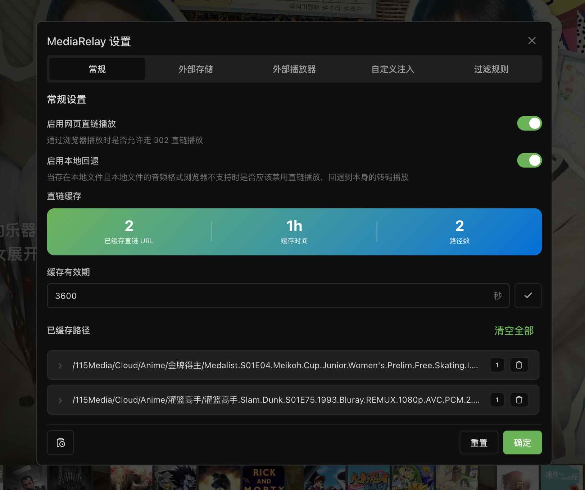
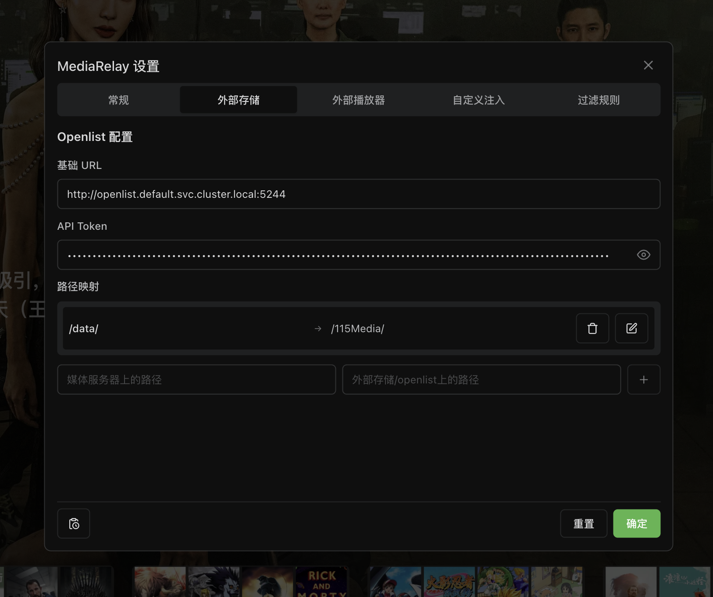
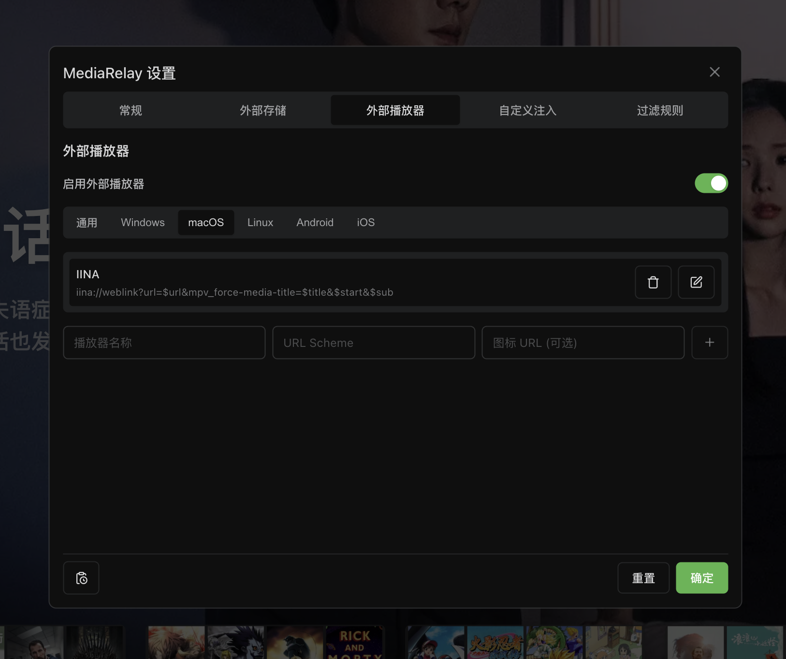
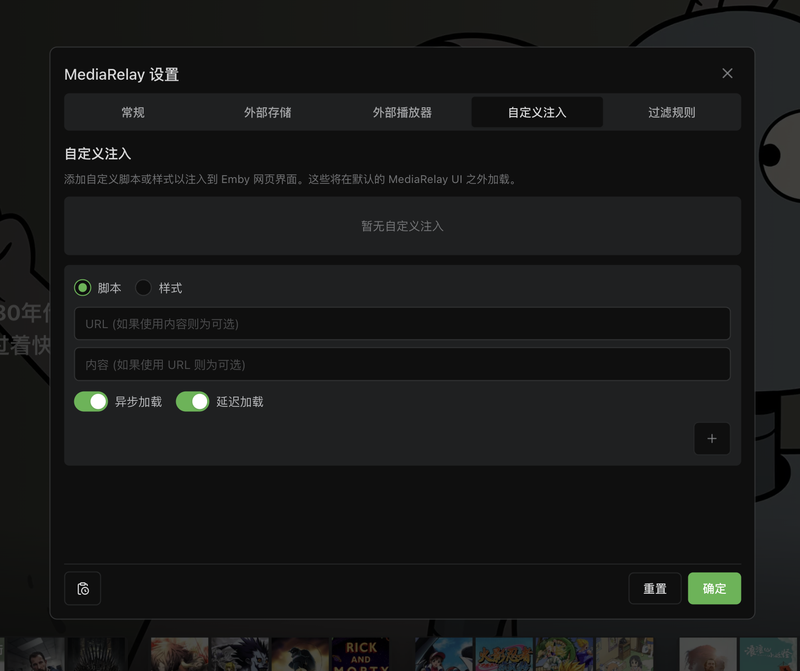
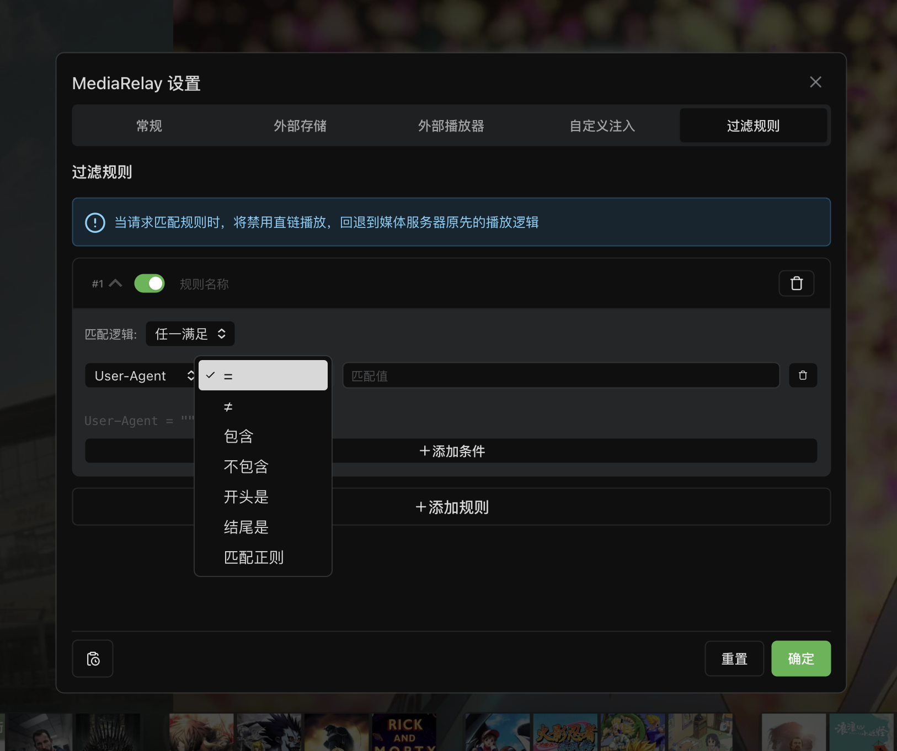
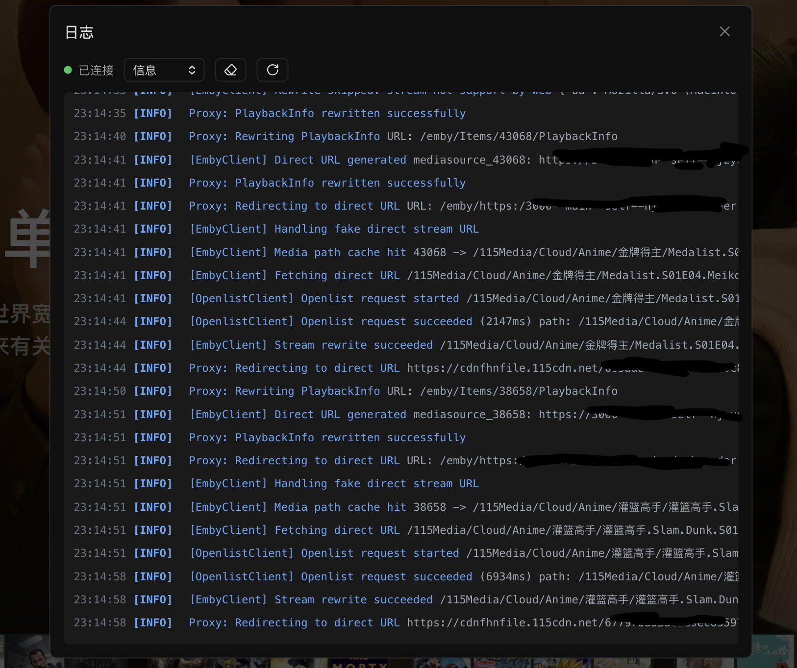

# MediaRelay

一款 Emby/Jellyfin 请求中继/代理工具，核心功能就是将视频流相关请求302重定向到网盘直链上，从而彻底解决由于带宽不足导致的公网观看视频卡顿问题

> [!IMPORTANT]
> 仅限个人使用，多人使用下，网盘封控概率会很大，且是否能成功302直链访问依赖因素也比较多，所以 GitHub Issues 暂时关闭，如有使用问题、建议或功能反馈，请先加入 [Telegram 群组](你的TG链接) 进行沟通

## 功能特性

- **302网盘直链重定向** 利用 openlist 获取网盘直链并结合 lru 缓存和请求合并功能，尽可能加速起播速度并降低网盘封控概率，核心支持两种场景：
  - 存在本地媒体文件，且媒体文件通过类似 cd2 方式已备份到远程网盘，此时可通过在 openlist 上挂载对应网盘并使用 mediarelay 的 pathmap 能力实现直接走网盘直链播放
  - [openlist strm](https://doc.oplist.org/guide/advanced/strm)
- **web 外部播放器** 支持在 emby/jellyfin web 页面上通过外部播放器进行播放
  - 新增/修改播放器 scheme 可视化配置且不同平台仅展示对应平台播放器
  - 深度适配 iina，支持标题、外挂字幕、跳转历史播放位置 需下载[自编译版本](https://github.com/njzydark/iina/actions/runs/21243531374#artifacts)
- **js/css 注入**
- **规则过滤** 完善的规则过滤功能，可根据 ua，hostname，ip，媒体文件路径等信息灵活控制是否应该跳过直链播放
- **webui** 提供 webui 进行可视化配置，并深度适配 emby/jellyfin，就像内置功能一样，可在原 web 页面上直接进行配置
  - pc/移动端适配
  - 适配 emby/jellyfin 夜间模式
  - 完善的日志功能，中继/代理核心链路日志全覆盖

## 快速开始

前置依赖：

- emby/jellyfin 媒体服务
- openlist

```bash
# emby
docker run -d --name mediarelay -e EMBY_URL=http://xxx:8096 -v ./config:/app/config -p 3000:3000 mediarelay
# jellyfin
docker run -d --name mediarelay -e JELLYFIN_URL=http://xxx:8096 -v ./config:/app/config -p 3000:3000 mediarelay
```

访问 3000 端口，点击顶部头像即可看到 mediarelay 功能设置入口

## WebUI 功能展示

常规设置下主要是查看直链缓存情况和控制 webDirect 开关



外部存储用于配置 openlist 和进行 path map



配置外部播放器 scheme



如果需要注入额外的 js/css 可以使用此功能



目前主要是一些基础的 ua ip 规则



用于排查问题，核心日志链路全覆盖



## Dev

项目使用 `deno` 作为 `js/ts` 运行时，需要先安装 [deno](https://deno.com/)

然后执行以下命令可进入开发模式

```bash
# 安装依赖
deno install
# 进入开发模式
deno task dev
```

## License

MIT
